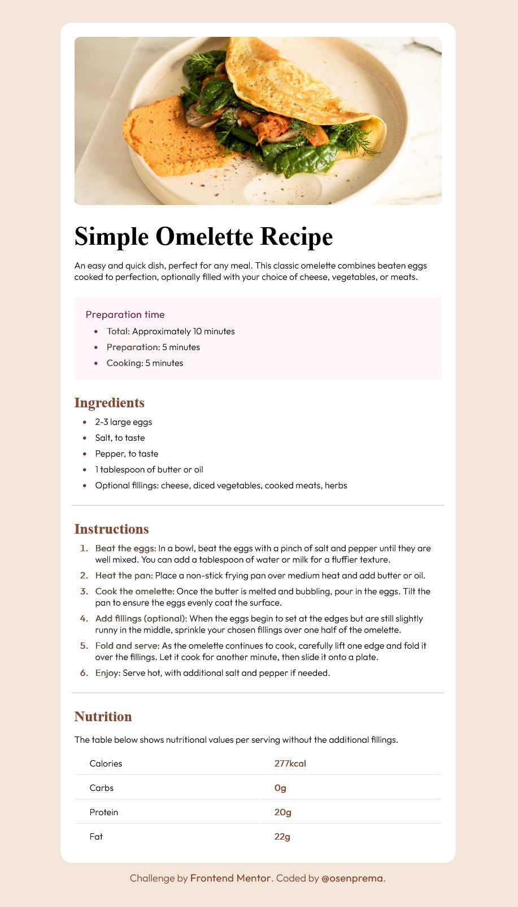

# Frontend Mentor - Recipe page solution

This is a solution to the [Recipe page challenge on Frontend Mentor](https://www.frontendmentor.io/challenges/recipe-page-KiTsR8QQKm). Frontend Mentor challenges help you improve your coding skills by building realistic projects. 

### Screenshot



### Built with

- Semantic HTML5 markup
- CSS custom properties
- Mobile-first workflow

### What I learned

I learned using of @font-face and @media querys directives for responsive desings.

```css
@font-face {
  font-family: 'Outfit-Light';
  src: url('./assets/fonts/outfit/static/Outfit-Light.ttf');
}

@media only screen and (min-width: 600px) {
  body {
    padding: 40px;
  }  
}
```

## Author

- Frontend Mentor - [@osenprema](https://www.frontendmentor.io/profile/osenprema)
